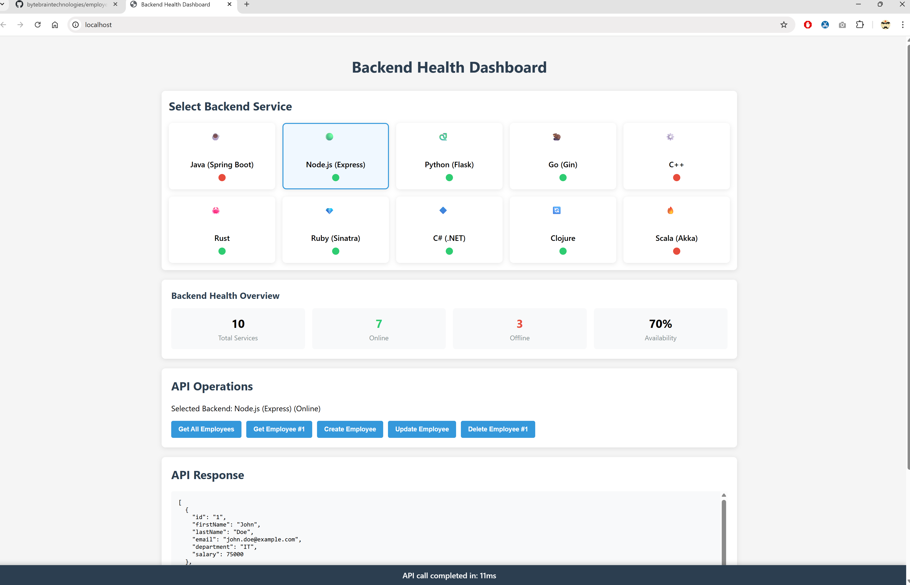
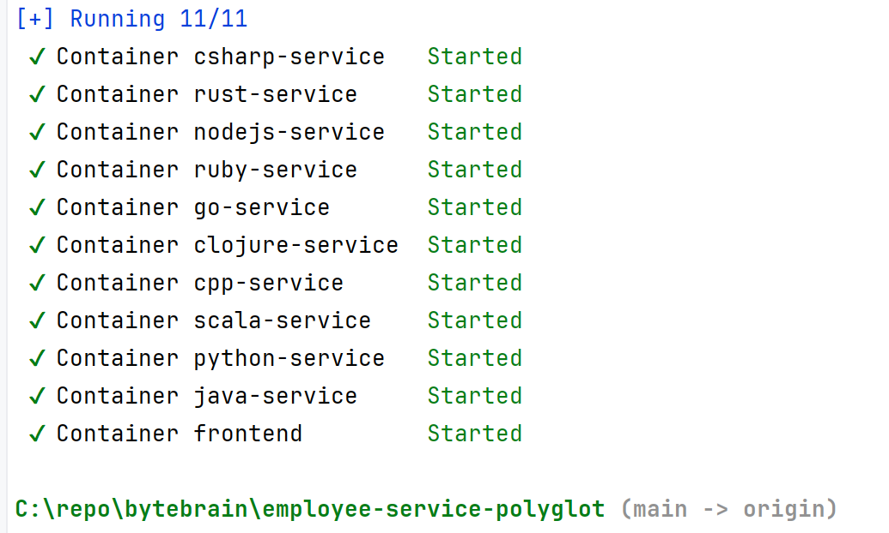

# Employee Service Multi-Implementation

This project provides implementations of an Employee CRUD Service with an in-memory database in several different programming languages/frameworks:

1. Java (Spring Boot)
2. Node.js (Express)
3. Python (Flask)
4. Go (Gin)
5. Ruby (Sinatra)
6. C#/.NET (ASP.NET Core)
7. Clojure (Ring/Compojure)
8. Rust (Actix Web)
9. C++ (Crow)
10. Scala (Akka HTTP)

Each implementation follows similar architecture patterns while leveraging the idiomatic approaches of its respective language.

## Common Features Across All Implementations

- RESTful API endpoints for employee management
- In-memory database with sample data initialization
- CRUD operations (Create, Read, Update, Delete)
- Comprehensive transaction logging
- Error handling and validation
- Postman collection for testing

## API Endpoints (Same Across All Implementations)

| HTTP Method | Endpoint | Description |
|-------------|----------|-------------|
| GET | /api/employees | Get all employees |
| GET | /api/employees/{id} | Get employee by ID |
| POST | /api/employees | Create new employee |
| PUT | /api/employees/{id} | Update employee |
| DELETE | /api/employees/{id} | Delete employee |

## Implementation Specifics

### 1. Java (Spring Boot)

**Directory**: `employee-service`

**Features**:
- Spring Boot with Spring Data JPA
- H2 in-memory database
- Annotation-based validation
- Transaction management
- Structured logging

**Running the Application**:
- Navigate to the directory: `cd employee-service`
- Run the batch file: `run.bat`
- Access at: http://localhost:8080
- H2 Console: http://localhost:8080/h2-console

**Strengths**:
- Strong type safety
- Robust ORM capabilities
- Extensive ecosystem
- Enterprise-grade features

### 2. Node.js (Express)

**Directory**: `employee-service-nodejs`

**Features**:
- Express web framework
- Array-based in-memory storage
- Winston and Morgan for logging
- CORS support
- Middleware-based architecture

**Running the Application**:
- Navigate to the directory: `cd employee-service-nodejs`
- Run the batch file: `run.bat`
- Access at: http://localhost:3000

**Strengths**:
- JavaScript simplicity
- Non-blocking I/O
- Lightweight and fast
- Excellent for real-time applications

### 3. Python (Flask)

**Directory**: `employee-service-python`

**Features**:
- Flask web framework
- Dictionary-based in-memory storage
- Loguru for structured logging
- Pydantic for data validation
- Blueprint-based routing

**Running the Application**:
- Navigate to the directory: `cd employee-service-python`
- Run the batch file: `run.bat`
- Access at: http://localhost:5000

**Strengths**:
- Easy to read and write
- Rapid development
- Strong data validation
- Excellent for data processing

### 4. Go (Gin)

**Directory**: `employee-service-go`

**Features**:
- Gin web framework
- Map-based in-memory storage with mutex for concurrency
- Logrus for structured logging
- Built-in validation
- Thread-safe operations

**Running the Application**:
- Navigate to the directory: `cd employee-service-go`
- Run the batch file: `run.bat`
- Access at: http://localhost:8080

**Strengths**:
- High performance
- Built-in concurrency
- Strong static typing
- Memory efficiency
- Excellent for microservices

## Which Implementation to Choose?

The choice between these implementations depends on your specific needs:

- **Java (Spring Boot)**: Best for enterprise applications where robustness, type safety, and extensive ecosystem are important
- **Node.js**: Great for real-time applications, microservices, and when you need JavaScript across the stack
- **Python**: Excellent for rapid development, data processing, and when readability is a priority
- **Go**: Ideal for high-performance services, microservices where concurrency matters, and when memory efficiency is important
- **Ruby**: Perfect for rapid development, clean syntax, and developer happiness with elegant code
- **C#/.NET**: Great for Windows-based environments, enterprise applications, and teams familiar with Microsoft technologies
- **Clojure**: Excellent for functional programming, data processing, and teams looking for a modern Lisp dialect with JVM benefits
- **Rust**: Perfect for systems programming with memory safety guarantees and performance comparable to C/C++
- **C++**: Ideal for performance-critical applications where low-level control is necessary
- **Scala**: Great for combining object-oriented and functional programming with JVM performance

Each implementation demonstrates the idiomatic patterns and best practices of its respective language and framework.

## Testing

Each implementation includes its own Postman collection for testing the API endpoints:

- Java: `Employee_Service_Java_Postman_Collection.json`
- Node.js: `Employee_Service_NodeJS_Postman_Collection.json`
- Python: `Employee_Service_Python_Postman_Collection.json`
- Go: `Employee_Service_Go_Postman_Collection.json`
- Ruby: `Employee_Service_Ruby_Postman_Collection.json`
- C#/.NET: `Employee_Service_CSharp_Postman_Collection.json`
- Clojure: `Employee_Service_Clojure_Postman_Collection.json`
- Rust: `Employee_Service_Rust_Postman_Collection.json`
- C++: `Employee_Service_CPP_Postman_Collection.json`
- Scala: `Employee_Service_Scala_Postman_Collection.json`

Import the appropriate collection into Postman to test the corresponding implementation.

## Dashboard Interface

The project includes a unified dashboard for monitoring and managing all implementations of the employee service. The dashboard allows you to:

- View the status of all running services
- Compare performance metrics across implementations
- Manage employees through a unified interface
- Monitor request logs and system health 
- Switch between implementations seamlessly



*The dashboard provides a comprehensive view of all employee service implementations with real-time metrics and a unified management interface.*

## Project Structure

```
root/
├── employee-service-java/        # Java (Spring Boot) implementation
├── employee-service-nodejs/      # Node.js (Express) implementation
├── employee-service-python/      # Python (Flask) implementation
├── employee-service-go/          # Go (Gin) implementation
├── employee-service-ruby/        # Ruby (Sinatra) implementation
├── employee-service-csharp/      # C#/.NET (ASP.NET Core) implementation
├── employee-service-clojure/     # Clojure (Ring/Compojure) implementation
├── employee-service-rust/        # Rust implementation
├── employee-service-cpp/         # C++ implementation
├── employee-service-scala/       # Scala implementation
├── frontend-app/                 # Dashboard UI implementation
├── docker/                       # Docker configuration files
├── readme-resources/             # Documentation resources and images
├── docker-compose.yml            # Docker Compose configuration
├── PORT_ASSIGNMENTS.md           # Port assignments for each implementation
└── README.md                     # This file
```

## Getting Started

### Option 1: Running Services Individually

1. Choose the implementation that best suits your needs
2. Navigate to the corresponding directory
3. Run the `run.bat` file in that directory
4. Use the provided Postman collection to test the API

### Option 2: Running with Docker (Recommended)

The project includes Docker support to run all services together with a single command:

1. Make sure Docker and Docker Compose are installed on your system
2. From the root directory, run: `docker-compose up` (or `docker-compose up -d` to run in detached mode)
3. All services and the dashboard will start in their respective containers
4. Access the dashboard at: http://localhost:80 (or simply http://localhost)

This will start all 10 service implementations (Java, Node.js, Python, Go, Ruby, C#, Clojure, Rust, C++, and Scala) and the frontend dashboard. Each service runs on its own port:

- Frontend: Port 80
- Java service: Port 8080
- Node.js service: Port 8081
- Python service: Port 8082
- Rust service: Port 8083
- C++ service: Port 8084
- Ruby service: Port 8085
- C# service: Port 8086
- Clojure service: Port 8087
- Go service: Port 8088
- Scala service: Port 8089

To stop all containers, press Ctrl+C (if running in foreground) or run `docker-compose down`.

When all services are running successfully, you should see output similar to:



### Starting the Dashboard Separately

If you want to run just the dashboard (when services are already running):

1. Navigate to the frontend-app directory: `cd frontend-app`
2. Install dependencies: `npm install`
3. Start the dashboard: `npm start`
4. Access the dashboard at: http://localhost:3000

The dashboard will automatically detect and connect to all running employee service implementations.
